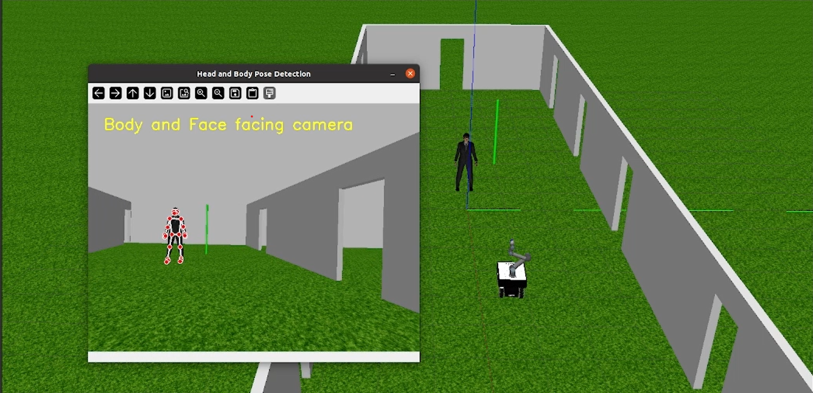

# PAWK: Pedestrian Avoidance With Kairos

This project developed in collaboration with [Francesco Zampirollo](https://github.com/zampifre) and [Emma Scinti Roger](https://github.com/Emmascinti) aims to have an obstacle avoidance control analizing actors attention on Robotnik Kairos simulator, implemented using a MPC algorithm. 

# Setup

## Clone Project
```sh
git clone https://github.com/StePoli-00/Smart-Robotics-Project.git
cd Smart-Robotics-Project
```
## Install Dependencies
>[!WARNING] 
> for our experience conda and pip environment did not work properly with ROS, we recomand you to install python package in your file system even if is not the
best practice. If you are expert with ROS workspace and virtual env, follow this command
```sh
conda create --name <env_name>
conda activate <env_name>
pip install -r requirements.txt
conda install python (our version is 3.12)
```
## Build the project
> [!IMPORTANT]
> BUILD ALWAYS with catkin_make specify python3
```sh
catkin_make -DPYTHON_EXECUTABLE=/usr/bin/python3
cd pedestrian_detection
```

## Run simualtor and obstacle avoiding algorithm
## Load actor model
> [!NOTE]
> Before to start the simulation, copy `business_man` model located at `Smart-Robotics-Project/simulation/models/business_man` inside `<username>/home/.gazebo/models` (CTRL+H to see hiding file)

1. Just running the simulation, all the required node will be instantiated 
```sh
roslaunch rbkairos_sim_bringup rbkairos_complete.launch
```

# Repository Overview
most of our work is located in `catkin_ws/src`, inside you can find:

## Resources
* actor_collision: plugin to make actor model collidable inside gazebo

## Nodes
* pedestrian_detection: rosnode to detect pedestrian pose and send it to robot navigation algorithm
* get_current_pose: get robot position  and update it
* mpc algorithm: rosnode to control robot navigation (specifically algorithm_v3.py)
* robot_goal_mover: rosnode that calculate distance from the target


if you want to test different world in `catkin_ws/src/rbkairos_sim/rbkairos_gazebo/worlds` modify the following line  6-7 of `rbkairos_complete.launch` located in `catkin_ws/src/rbkairos_sim/rbkairos_sim_bringup/launch/`

```xml
    <arg name="launch_rviz" default="true"/>
    <arg name="gazebo_world" default="$(find rbkairos_gazebo)/worlds/<filename></filename>.world"/>
```


